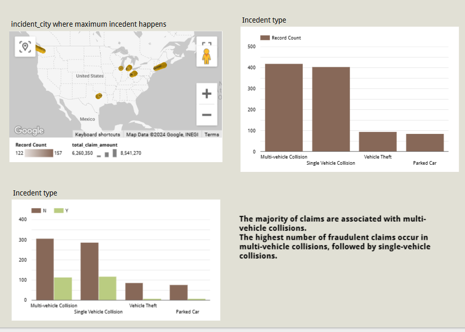
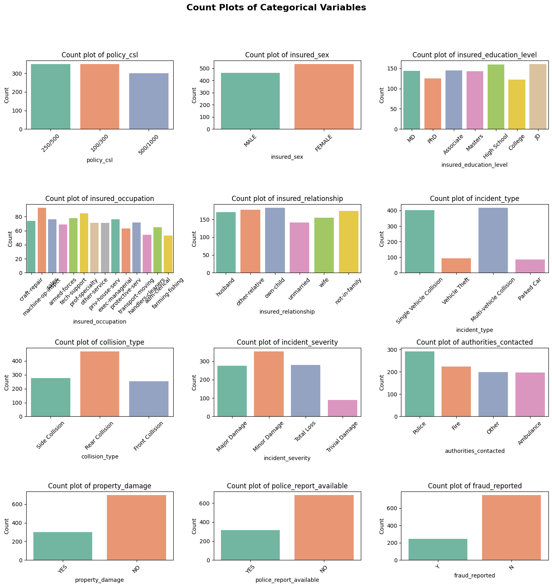
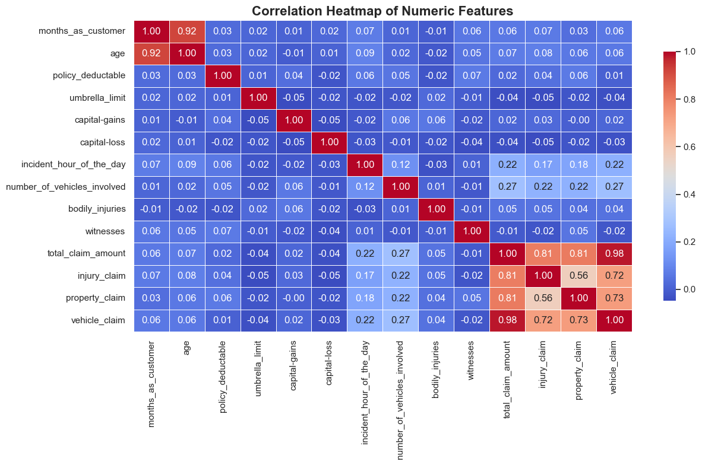
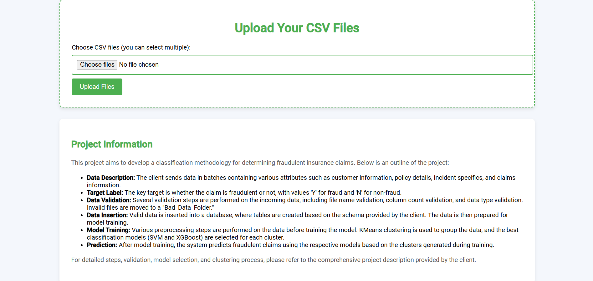
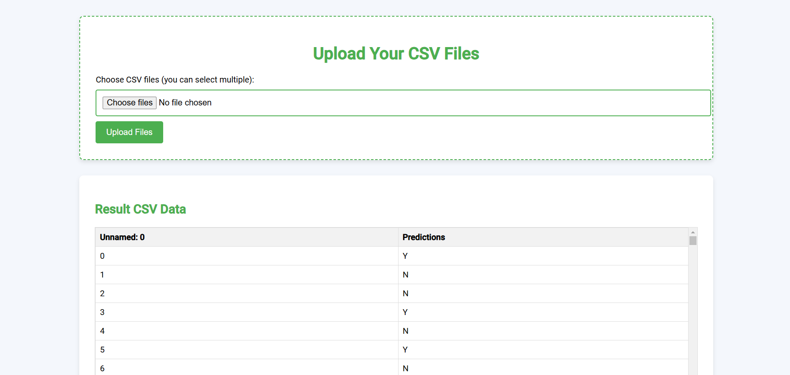

# Insurance-Fraud-Detection

The objective is to develop a machine learning-based classification model to identify fraudulent vehicle insurance claims. With the increasing number of insurance claims, it becomes imperative for insurance companies to accurately distinguish between legitimate and fraudulent claims to minimize losses and optimize resource allocation. The model should be able to predict whether a given claim, based on a set of features (e.g., accident type, claim amount, customer history), is fraudulent or genuine. This solution will enhance the efficiency of fraud detection systems, reduce financial risks, and improve overall operational effectiveness in the insurance industry.
## Data Description:
The dataset consists of information related to vehicle insurance claims, including both legitimate and fraudulent claims. The data is structured with multiple features that describe the claim, the vehicle, and the claimant. Below is a detailed overview of the key features in the dataset:

1.	months_as_customer: It denotes the number of months for which the customer is associated with the insurance company.
2.	age: continuous. It denotes the age of the person.
3.	policy_number: The policy number.
4.	policy_bind_date: Start date of the policy.
5.	policy_state: The state where the policy is registered.
6.	policy_csl-combined single limits. How much of the bodily injury will be covered from the total damage.
https://www.berkshireinsuranceservices.com/arecombinedsinglelimitsbetter  
7. policy_deductable: The amount paid out of pocket by the policy-holder before an insurance provider will pay any expenses.
8. policy_annual_premium: The yearly premium for the policy.
9. umbrella_limit: An umbrella insurance policy is extra liability insurance coverage that goes beyond the limits of the insured's homeowners, auto or watercraft insurance. It provides an additional layer of security to those who are at risk of being sued for damages to other people's property or injuries caused to others in an accident.
10. insured_zip: The zip code where the policy is registered.
11. insured_sex: It denotes the person's gender.
12. insured_education_level: The highest educational qualification of the policy-holder.
13. insured_occupation: The occupation of the policy-holder.
14. insured_hobbies: The hobbies of the policy-holder.
15.	insured_relationship: Dependents on the policy-holder.
16.	capital-gain: It denotes the monitory gains by the person.
17.	capital-loss: It denotes the monitory loss by the person.
18.	incident_date: The date when the incident happened.
19.	incident_type: The type of the incident.
20.	collision_type: The type of collision that took place.
21.	incident_severity: The severity of the incident.
22.	authorities_contacted: Which authority was contacted.
23.	incident_state: The state in which the incident took place.
24.	incident_city: The city in which the incident took place. 
25.	incident_location: The street in which the incident took place.
26.	incident_hour_of_the_day: The time of the day when the incident took place.
27.	property_damage: If any property damage was done.
28.	bodily_injuries: Number of bodily injuries.
29.	Witnesses: Number of witnesses present.
30.	police_report_available: Is the police report available.
31.	total_claim_amount: Total amount claimed by the customer.
32.	injury_claim: Amount claimed for injury
33.	property_claim: Amount claimed for property damage.
34.	vehicle_claim: Amount claimed for vehicle damage.
35.	auto_make: The manufacturer of the vehicle
36.	auto_model: The model of the vehicle. 
37.	auto_year: The year of manufacture of the vehicle. 

The target variable for this dataset is Claim Status, which is used to classify the claims as either legitimate or fraudulent. The dataset contains both numerical and categorical variables, which will require preprocessing for model training. The aim is to develop a predictive model capable of accurately distinguishing between fraudulent and non-fraudulent insurance claims based on these features.

## Roadmap

1. Data Validation

- File Name Validation: Files are validated against a regex pattern for correct formatting. Valid files are moved to Good_Data_Folder, invalid ones to Bad_Data_Folder.
- Column Validation: We check the number and names of columns, ensuring they match the schema. Mismatches move files to the Bad_Data_Folder.
- Datatype Validation: Columns are checked for correct data types. Files with incorrect datatypes are moved to the Bad_Data_Folder.
- Null Values: Files with columns containing only null values are discarded.
2. Data Insertion in Database
- Database Connection: A database is created or connected to.
- Table Creation: A table named Good_Data is created if it doesn't exist, and valid data is inserted.
- File Insertion: Files from the Good_Data_Folder are inserted into the database. Invalid files are moved to Bad_Data_Folder.
3. Model Training
- Data Export: Data is exported from the database as a CSV file.
- Preprocessing: Columns are dropped, null values are imputed, categorical values are encoded, and numeric values are scaled.
- Clustering: KMeans clustering is applied, and optimal clusters are selected using the elbow method and KneeLocator.
- Model Selection: SVM and XGBoost models are tested for each cluster, and the best-performing model is saved.
4. Prediction
- Data Preprocessing: New data is preprocessed in the same way as the training data.
- Clustering: The pre-trained KMeans model predicts the cluster for the new data.
- Prediction: The corresponding model for each cluster is used to make predictions.
- Save Predictions: The predictions are saved in a CSV file, and display to the web brouser.


## Installation

Install the python and activate it: 

```bash
conda create -n fraud python=3.9 -y

source ~/anaconda3/etc/profile.d/conda.sh
```

```bash
conda activate fraud

``````
Install requirements.txt file
```bash
pip install -r requirements.txt

``````
## Data Insights & Analysis

- In our database, 25% of the data represents fraudulent claims, while 75% corresponds to non-fraudulent claims.
- Fraudulent claims are more commonly associated with individuals in the 30-40 age group.

- The highest number of claims were reported from Springfield city.







